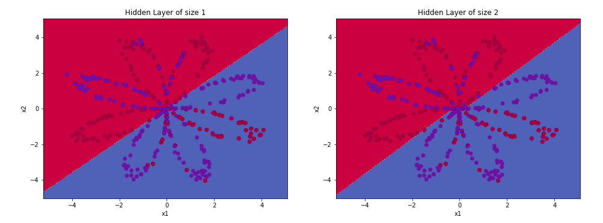
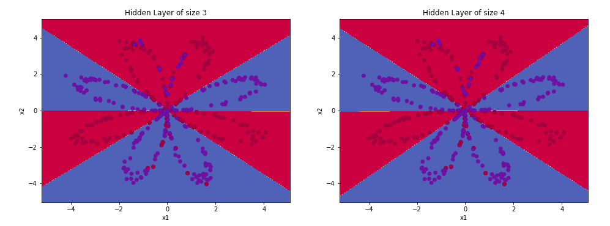
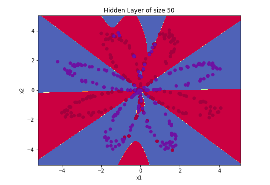

# Planar Data Classification

This project deals with the study of the basic 
concepts of neural networks. In this study, 
we compared the logistic regression algorithm with 
a neural network with a hidden layer. Further on, 
we can see how the number of units in the hidden 
layer affects the model. From this basic application, 
we can visually understand the concepts of complexity, 
underfitting and overfitting in the learned model.

## Content

The main project files are archives for
jupyter notebook and other in python.
The .ipynb extension file provides a richer 
explanation of content and describes the implemented code in detail.
The .py extension file brings pure code into python.

### Samples
    
This image explains how the neural network handles 
our data set. The dataset used has 400 samples, in 2D. 
Some generated models can be seen in the images below, 
with different amounts of units in the hidden layer. 
We can see that the larger models 
(with more hidden units) are able to fit the training set
better, until eventually the largest models overfit 
the data.

